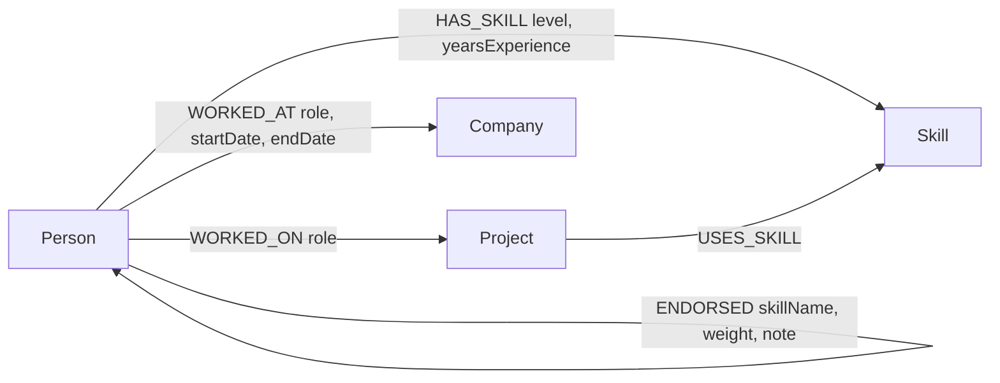

# SkillBridge — Skill & Mentor Matching Network

A graph-backed application, built on **CognoDB**, that helps people discover:

- 👤 People with particular skills
- 🧑‍🏫 Potential mentors
- 💼 People who worked on similar projects
- 🤝 Connections through their network
- ⭐ Endorsements for skills
- 🔗 Indirect connections between people

Built for the Wexa AI take-home assignment.

## Why a graph database?

The core value of SkillBridge is answering **relationship** questions, not
record-lookup questions: *"who can mentor me, given the people I already
work with?"* or *"how am I connected to this person two companies removed
from me?"*.

In a relational schema, `Person`, `Skill`, `Project`, `Company`, and
`Endorsement` would live in five-plus tables joined through junction tables.
A query like "find people who share a project with me and know AWS at an
advanced level" needs two self-joins through the `Person`↔`Project` and
`Person`↔`Skill` junction tables — and it only gets worse for deeper
questions. "How is person A connected to person B, through any relationship,
within 6 steps" has **no fixed number of joins** at all — it requires a
recursive CTE with manual cycle detection and no guarantee of finding the
*shortest* path efficiently.

In CognoDB, both of those are natural Cypher patterns:

```cypher
// Mentor: 2-hop traversal, shared project + skill
MATCH (requester:Person {id: $requesterId})-[:WORKED_ON]->(proj)<-[:WORKED_ON]-(mentor:Person)
MATCH (mentor)-[hs:HAS_SKILL]->(s:Skill {name: $skillName})
RETURN mentor, proj

// Indirect connection: variable-length shortest path
MATCH (a:Person {id: $fromId}), (b:Person {id: $toId})
MATCH path = shortestPath((a)-[*..6]-(b))
RETURN path
```

Relationship traversal is CognoDB's native operation — it doesn't matter
whether the path is 1 hop or 6, the query shape barely changes and stays fast
because relationships are stored as first-class pointers, not
recomputed via joins at query time.

## Data model



**Nodes**
| Label | Properties |
|---|---|
| `Person` | id, name, title, bio, location, mentorAvailable, yearsExperience |
| `Skill` | id, name, category |
| `Project` | id, name, description, startDate, endDate |
| `Company` | id, name, industry |

**Relationships**
| Type | Direction | Properties |
|---|---|---|
| `HAS_SKILL` | Person → Skill | level, yearsExperience |
| `WORKED_ON` | Person → Project | role |
| `WORKED_AT` | Person → Company | role, startDate, endDate |
| `ENDORSED` | Person → Person | skillName, weight, note |

## Feature coverage

The pitch names six discovery features. They map to five pages:

| Feature | Where |
|---|---|
| People with particular skills | **People & Skills** page |
| Potential mentors | **Find a Mentor** page |
| People who worked on similar projects | **Projects** page (browse a project → see every contributor) |
| Endorsements for skills | **Top Endorsed** page + Person Detail page |
| Indirect connections between people | **Indirect Connections** page, with a filter for "any / work history / shared skills / endorsements only" |
| Connections through their network | Person Detail page (skills/projects/companies) + Indirect Connections page |

Click any person card anywhere in the app to open their full **Person Detail**
profile (skills, projects, companies, endorsements received).

## Project structure

```
skillbridge/
├── backend/     Spring Boot + Spring Data Neo4j REST API
├── frontend/    React (Vite) single-page app
├── seed/        Python seed script + sample data.json
└── README.md
```

## Setup

### 1. Create your CognoDB instance
1. Sign up at https://console.cognodb.com/signup (free, no card required).
2. Create a free `c0` instance and pick a region.
3. Copy the `bolt+s://...` URI and the generated password for user `cognodb`
   — the password is shown once.

### 2. Seed the database
```bash
cd seed
pip install -r requirements.txt
export NEO4J_URI="bolt+s://<your-instance-id>.databases.cognodb.cloud"
export NEO4J_USERNAME="cognodb"
export NEO4J_PASSWORD="<your password>"
python seed.py
```

### 3. Run the backend
```bash
cd backend
cp .env.example .env   # fill in your real CognoDB credentials
export $(cat .env | xargs)   # or use your IDE's env var support
./mvnw spring-boot:run
```
The API starts on `http://localhost:8080`.

### 4. Run the frontend
```bash
cd frontend
npm install
cp .env.example .env   # defaults to http://localhost:8080
npm run dev
```
Open `http://localhost:5173`.

## Main queries, explained

1. **`PersonRepository.findPeopleWithSkill`** — single-hop lookup of everyone
   with a given skill, ranked by endorsement count for that skill and years
   of experience. Powers **People & Skills** search.
2. **`GraphQueryService.findMentorsViaSharedProject`** — the required
   **2+ hop traversal**: `requester -[:WORKED_ON]-> project <-[:WORKED_ON]- mentor -[:HAS_SKILL]-> skill`.
   Finds mentors you're already one project away from. Powers **Find a Mentor**.
3. **`GraphQueryService.findShortestConnection`** — the required
   **SQL-awkward query**: a `shortestPath()` traversal, optionally restricted
   to a relationship-type category (`work`, `skills`, `endorsements`, or `any`),
   up to 6 hops, with no fixed join count. Powers **Indirect Connections**.
4. **`GraphQueryService.findContributorsForProject`** — single-hop lookup of
   everyone who worked on a given project. Powers **Projects**.
5. **`GraphQueryService.findEndorsementLeaderboard`** — aggregates endorsement
   counts per person across the whole graph. Powers **Top Endorsed**.

All queries run through parameterised Cypher — either Spring Data Neo4j's
`@Query` annotation or the official Neo4j Java driver directly — with no
string-concatenated *user input*. The one exception is the `via` filter on
the shortest-path query: Cypher does not allow parameterising relationship
type names inside a pattern, so that fragment is resolved server-side against
a small fixed whitelist (`any`/`work`/`skills`/`endorsements`) rather than
ever inserting raw request text into the query.

### Why "Indirect Connections" mostly shows skill/endorsement hops

By default, `shortestPath()` returns the *shortest* path through any
relationship type. Skills like "Java" or "React" are shared by many people
(they act as hub nodes), so a 2-hop path through a shared skill is usually
available — while a shared project or company match is rarer and would
require a longer path. The algorithm always prefers the shorter route, so it
naturally favors skill/endorsement hops unless you restrict it with the
`via` filter. This is a genuinely interesting graph-modeling observation to
raise in the interview: it's a direct, visible consequence of degree
distribution in the graph, not something you'd notice as easily in a
relational schema.

## Error handling

If CognoDB is unreachable, `GlobalExceptionHandler` catches
`ServiceUnavailableException` and returns a `503` with a friendly message,
which the frontend surfaces directly in each page's error state rather than
crashing.

## Deployment

- **Backend**: Railway or Render, set the same env vars as `.env.example`.
- **Frontend**: Vercel or Netlify, set `VITE_API_BASE_URL` to your deployed
  backend URL.

## Screenshots

_Add screenshots of People & Skills, Find a Mentor, and Indirect Connections
here before submitting._

## Demo

_Add your hosted demo link and screen recording link here before submitting._
